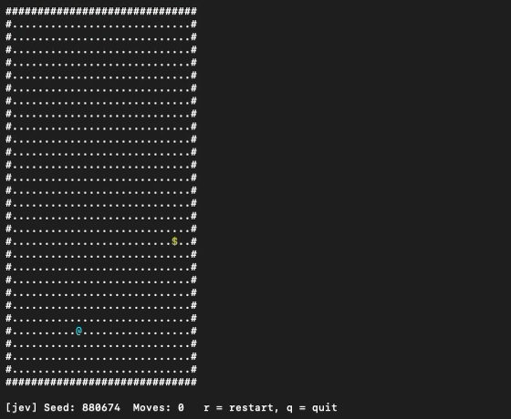
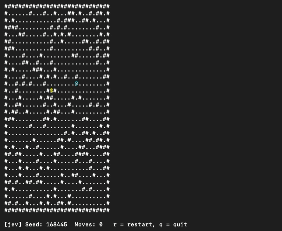

# Jev against walls

Author: dre-pin

Model `jev-1.13.0` · walls at 25% of cells vs none · 73 games, 950 logged moves · 22 Sep 2026

**Jev finds the treasure on open maps and gets lost as soon as walls appear.** On the
same 30×30 maps, with `@` and `$` in the same spots, removing the walls takes Jev from
solving a quarter of games to solving nearly all of them, usually in the fewest moves
possible. The logs show why: Jev reads where the treasure is correctly, then walks
straight into whatever wall is in the way. Open maps have one weak spot of their own:
right next to the treasure, Jev sometimes mixes up left and right.

## Watch it

Recorded runs, cropped to the map. The status line under each map shows Jev's pick,
its confidence and the response time for every move.

**No walls** · seed `880674`, found in 22 moves, the fewest possible:



**Walls** · seed `168445`, where the treasure is only 8 moves away (sped up 1.5×). After
86 moves Jev is two cells from `$` with a wall between them. On the same map without
walls, Jev finds it in 8.



**Full recordings** (GitHub can't play these in the browser, so the links download the files):

- [no_walls.mov](docs/no_walls.mov) (download, 2.2 MB): 12 games without walls (1 min 28 s).
- [with_walls.mov](docs/with_walls.mov) (download, 8.4 MB): the 11 walled seeds from the table below (3 min 35 s).
  These runs used a `--notify_stuck` flag that has since been removed; it made no difference
  to which maps Jev solved.

## At a glance

| | No walls | Walls (25%) |
| --- | --- | --- |
| Games reached | **22 of 23 (96%)** | **12 of 50 (24%)** |
| Moves that got closer | 89% | 35% |
| Moves into a wall | 0% | 41% |
| Games won in the fewest possible moves | 16 of 22 | 5 of 12 |
| Average confidence per move | 0.71 | 0.30 |

Win rates count every game run. Per-move figures come from the games that have a debug
log: 23 without walls (417 moves) and 10 with walls (533 moves). "Closer" means the move
shortened the true shortest route to `$`, walls included.

## Same 11 maps, walls removed

The game places `@` and `$` before it adds walls, so running a seed without `--walls`
gives the same start and treasure on an empty board. That makes this a direct test:
nothing changes except the walls.

| Seed | Shortest route with walls | Shortest route no walls | With walls | No walls |
| --- | ---: | ---: | --- | --- |
| 277307 | 1 | 1 | 3 of 3 reached (1, 1, 1) | reached in 1 |
| 300754 | 8 | 8 | 3 of 3 reached (10, 73, 8) | reached in 8 |
| 168445 | 8 | 8 | 0 of 3 (stopped at 34, 87, 44) | reached in 8 |
| 678259 | 12 | 4 | 0 of 3 (39, 116, 40) | reached in 4 |
| 210845 | 13 | 13 | 0 of 3 (56, 69, 56) | reached in 15 |
| 916897 | 13 | 13 | 0 of 3 (38, 127, 45) | reached in 13 |
| 239767 | 13 | 11 | 0 of 3 (43, 116, 53) | reached in 11 |
| 165797 | 20 | 16 | 0 of 3 (33, 80, 51) | reached in 16 (twice) |
| 740096 | 24 | 20 | 0 of 4 (53, 201, 101, 44) | reached in 20 |
| 516730 | 27 | 25 | 1 of 3 reached (96; stopped at 43, 81) | reached in 25 |
| 839715 | 28 | 28 | 0 of 3 (33, 123, 53) | reached in 28 |
| **Total** | | | **7 of 34 runs · 3 of 11 maps ever solved** | **12 of 12 runs · 10 of 11 in the fewest moves** |

The walls don't make these routes much longer: on six of the 11 maps the shortest route
is exactly as long with walls as without. Seed `168445` is 8 moves either way. Jev solves
it in 8 on the open board and failed all three walled attempts, each given 34 to 87 moves.

## What each move did

Every logged move was replayed on its seed's map and sorted by what happened to `@`.

| Moves | Got closer | Hit a wall (didn't move) | Moved away | Total |
| --- | ---: | ---: | ---: | ---: |
| No walls | 373 (89.4%) | 0 (0%) | 44 (10.6%) | 417 |
| Walls | 186 (34.9%) | 216 (40.5%) | 131 (24.6%) | 533 |

## Why: Jev knows which way to go, and ignores the walls

**166 of the 216 wall hits (77%) were moves straight toward the treasure.** Jev picked the
right direction and walked into the wall in front of it.

Measured by straight-line distance, which ignores walls, 68% of Jev's walled moves pointed
toward `$`. So it still reads where the treasure is. What it doesn't do is notice that the
cell in that direction is a `#`. Its first move got closer in all 23 open games but in only
5 of the 10 walled games.

After a wall hit, Jev tends to fall into a loop: hit the wall, step sideways, step back,
hit the same wall again. One character per move, in order (`+` got closer, `x` hit a
wall, `-` moved away):

```
839715  no walls  reached in 28 (fewest possible)
++++++++++++++++++++++++++++

592141  walls     reached in 19 (shortest route 10)
++x-+xx++++++x-+x++

991353  walls     stopped at 125 (first 70 shown)
x+++++++-x+-xx+x-+x-x+-x+-x+-x+-x+-x+-x+-x+-x++++++++++x-+x-+x-+x-+x++

774109  walls     stopped at 28
-xxxxxxxxxxxxxxxxxxxxxxxxxxx
```

Seed `774109` is the extreme case. After its first move, `@` sat in a pocket with walls to
the left, above and below. The only way out was right, away from the treasure. Jev picked
left, up or down 27 times in a row and never picked right.

## Without walls: a left/right mix-up next to the treasure

> **Note:** I'm exploring this left/right issue next.

Open maps weren't flawless: 44 of 417 moves went the wrong way. Every one of those 44 was a
left/right mix-up, and 42 of them happened with `$` one or two cells away on the same
row. Jev made no up/down mistakes at all.

| Where `$` was | Correct move | What Jev did |
| --- | --- | --- |
| Directly right of `@` (`@$`) | right | stepped onto it only 13 of 51 times; picked left the other 38 |
| Two to the left (`$.@`) | left | picked right 4 times |
| Directly left, above or below | that direction | took it on the first try, 9 of 9 |

Jev was less sure of itself near the treasure. Wrong-way moves averaged 0.52 confidence,
against 0.73 for moves that got closer. With `$` directly to the right, Jev put on average
only 0.36 of its probability on "right". Average confidence one cell from the treasure was
0.61, down from 0.78 at two to six cells away.

Seed `147700` shows the worst case. Jev played its first 37 moves perfectly and arrived one
cell left of the treasure (`@$`). For the remaining 68 moves it went back and forth: from
`@$` it stepped left, away from the treasure (confidence 0.30 to 0.71, average 0.58), then
from `@.$` it stepped right again (average 0.79). It did this 34 times, putting only 0.22
of its probability on the winning move each time, until it was stopped at move 105, still
one cell away. So it was quite sure the treasure was to the right when there was a gap,
and not when the two symbols touched.

This mix-up accounts for every extra move on an open map. The six open games won in more
than the fewest possible moves lost exactly those moves to it: 10 wrong-way steps and 10
steps back, 20 extra moves in total.

A likely cause, not yet tested: when `@` and `$` sit side by side in the text, the model
may read them as a single chunk, which makes their order hard to see. Vertical neighbors
sit on different lines, which would explain why above and below were never confused.

## Jev's confidence already signals the problem

Every TypeSafe answer comes with a probability for each option. On open maps Jev is fairly
sure of itself (0.71 on average) and on average puts 0.81 of its probability on directions
that actually get closer. With walls, both collapse: average confidence drops to 0.30,
barely above the 0.25 of a random guess among four directions, and only 0.34 of its
probability lands on directions that get closer.

| | No walls | Walls |
| --- | ---: | ---: |
| Average confidence | 0.71 | 0.30 |
| …on moves that got closer | 0.73 | 0.29 |
| …on moves that didn't | 0.52 | 0.30 |
| Probability on directions that get closer | 0.81 | 0.34 |
| Response time (median) | 147 ms | 150 ms |

On open maps, confidence also separates good moves from bad ones (0.73 vs 0.52). With
walls it doesn't (0.29 vs 0.30). A low-confidence answer is Jev reporting that it can't
decide, and a harness could act on that, for example by rephrasing the question or handing
the move to a fallback.

## What to try next

- **Tell Jev which directions are blocked.** Add one line such as
  `Blocked from here: up, left`, worked out from the map. This targets the exact failure
  above: Jev knows the direction but doesn't see the wall.
- **Say when the treasure is next to Jev** (next up; see the note above). A line such as `Next to you: $ is right`
  should stop the left/right mix-up on open maps. To test the chunking guess first,
  swap `@` and `$` for other symbols and see whether the mix-up goes away.
- **Show a close-up around `@`.** A 5×5 section of the map centered on Jev, sent along
  with the full map, makes the walls next to it impossible to miss without adding
  coordinates.
- **Act on low confidence.** When the top answer is below about 0.4, try a follow-up
  question or a different strategy instead of taking the move.
- **Compare fairly.** Run a fixed set of seeds with `--max-moves 100 --debug` for each
  change, so every setup gets the same move limit and a log.

## How this was measured

- **Games.** 50 walled games (40 from terminal output, 10 with debug logs) and 23 open
  games (all logged). All used `jev-1.13.0`, and walled games used the default 25% wall
  density.
- **Flags ignored.** Runs made with `--notify_stuck` or `--previous-map` are pooled with
  plain runs. On the walled seeds neither flag changed which maps Jev could solve.
- **Win rates undercount the walled runs.** Many walled games were stopped by hand after
  24 to 201 moves, and some might have been solved with more moves. The per-move numbers
  don't depend on when a game was stopped.
- **Per-move scoring.** Each logged game was rebuilt from its seed. Every move was
  replayed and compared against the true shortest route to `$` (breadth-first search,
  walls included) and against straight-line distance (walls ignored).
- **One open game was not reached.** Seed `147700` (shortest route 38) was stopped after
  105 moves, one cell from the treasure.
- **Left/right analysis.** Each wrong-way move on an open map was checked against where
  `$` sat relative to `@` at that moment. 34 of the 44 wrong-way moves come from seed
  `147700`; the other 10 come from six other games.
- **Small sample.** 10 logged walled games. The gap between open and walled is large
  enough not to be noise, but the smaller percentages are rough.
